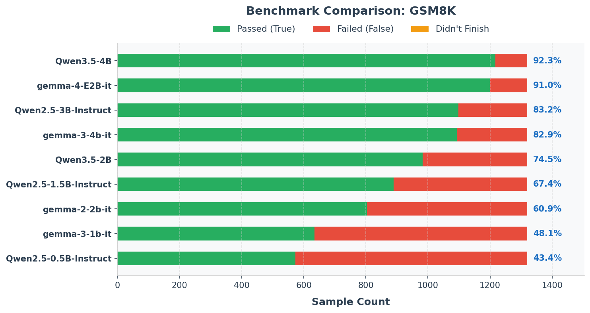
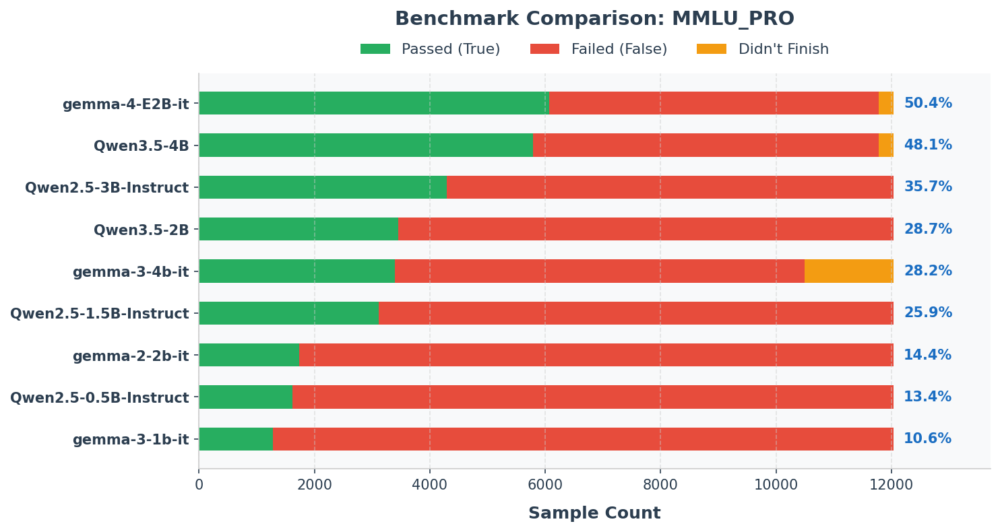
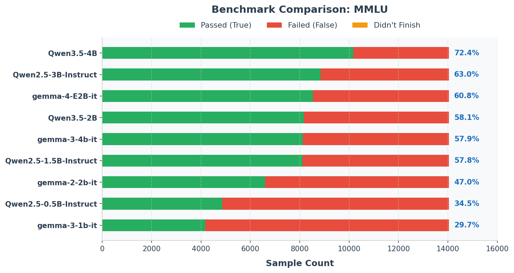
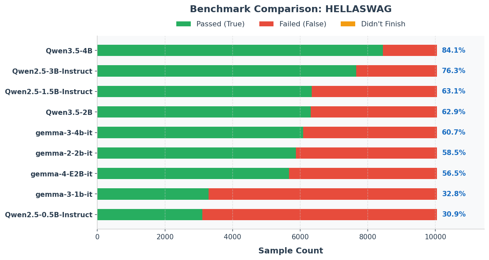
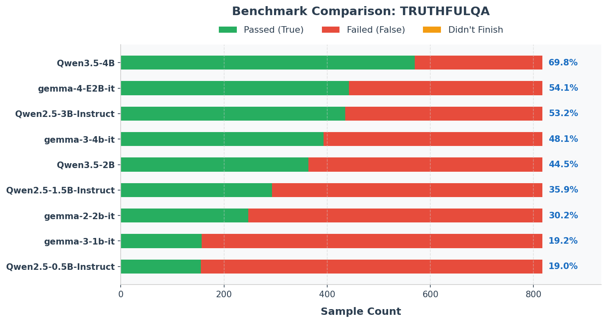

# LLM Evaluation Suite

A clean, modular Python suite for evaluating Large Language Models (LLMs) across standardized benchmark datasets (**MMLU**, **MMLU-Pro**, **GSM8K**, **HellaSwag**, **TruthfulQA**) using PyTorch / Transformers on multi-GPU systems.

> [!NOTE]
> **Evaluation Protocol Note**: This suite conducts **0-shot direct model evaluation** (direct option/answer prediction) and does not use 5-shot Chain-of-Thought (CoT) exemplars or multi-path sampling. Scores represent direct zero-shot model performance and will differ from self-reported 5-shot CoT leaderboards (see [Protocol Differences Guide](docs/scoring.md#protocol-differences--leaderboard-discrepancy-analysis)).

---

## Quickstart Guide

### 1. Installation & Authentication
```bash
# Install dependencies
pip install -r requirements.txt

# Authenticate with Hugging Face (for gated models/datasets)
export HF_TOKEN="your_hf_token"
```

### 2. Download Datasets & Models
```bash
# Download benchmark datasets into ./data/
python download_datasets.py --all

# Download model weights into ./models/
python download_models.py --model Qwen/Qwen2.5-0.5B-Instruct
```

### 3. Run Two-Stage Pipeline

```bash
# Stage 1: Run raw GPU model inference across active GPUs
python3 run_suite.py

# Stage 2: Extract answers, score generations, and create reports
python3 score_suite.py --latest
# (or target a specific folder: python3 score_suite.py --run_dir outputs/run_20260730_120000)
```

---

## Two-Stage Architecture

```text
  [Dataset JSON]
        |
        v
+-----------------+   Raw JSONL   +-----------------+
|     STAGE 1     |-------------->|     STAGE 2     |---> [report.md]
| GPU Inference   |               | Extract & Score |---> [results.csv]
+-----------------+               +-----------------+---> [summary.json]
```

1. Stage 1 - Raw GPU Generation (`eval.py` / `run_suite.py`):
   - Loads model onto a pinned GPU.
   - Formats prompts via evaluator classes (`evaluator.format_prompt`).
   - Runs batched inference and writes outputs (`prompt`, `dataset_item`, `model_output`, latency, throughput) to a JSONL log file.

2. Stage 2 - Extract, Evaluate & Score (`score_suite.py`):
   - Reads raw JSONL entries from Stage 1.
   - Uses benchmark-specific evaluator classes (`BaseEvaluator` subclasses) to extract answers (`extract_answer`) and think blocks (`extract_think`).
   - Scores extracted answers against gold standards (`score_item`) and generates consolidated reports.

---

## Supported Benchmark Datasets

| Dataset | Metric | Class Evaluator | Description |
| :--- | :--- | :--- | :--- |
| **GSM8K** | Numerical Accuracy (%) | `GSM8KEvaluator` | Grade school math word problems. |
| **MMLU** | Choice Accuracy (%) | `MMLUEvaluator` | 4-choice general knowledge test. |
| **MMLU-Pro** | Choice Accuracy (%) | `MMLUProEvaluator` | Advanced multi-domain test (up to 10 choices). |
| **HellaSwag** | Choice Accuracy (%) | `HellaSwagEvaluator` | Commonsense context completion. |
| **TruthfulQA** | Choice Accuracy (%) | `TruthfulQAEvaluator` | Truthfulness & misconception test. |

---

## Evaluation Reports & Visual Charts

The latest benchmark evaluation results and interactive summary tables can be found in **[docs/report.md](docs/report.md)**.

### Benchmark Model Comparisons

#### GSM8K Math Reasoning


#### MMLU-Pro Advanced Benchmark


#### MMLU General Knowledge


#### HellaSwag Commonsense Completion


#### TruthfulQA Truthfulness


---

## Core Scripts & CLI Options

* **`eval.py`**: Single-model evaluation job on a single pinned GPU.
  ```bash
  python3 eval.py --model Qwen2.5-0.5B-Instruct --benchmark gsm8k --gpu 0 --batch_size 1
  ```

* **`run_suite.py`**: Multi-GPU Stage 1 raw inference orchestrator.
  ```bash
  python3 run_suite.py              # Full Stage 1 run
  python3 run_suite.py --preflight 4  # Quick test with 4 samples per benchmark
  ```

* **`score_suite.py`**: Stage 2 scoring engine.
  ```bash
  python3 score_suite.py --latest
  python3 score_suite.py --run_dir outputs/run_20260730_120000
  ```

---

## Output Files

Each evaluation run generates output artifacts under `outputs/run_<timestamp>/` and automatically syncs the latest results to `docs/`:

- **`report.md`**: Consolidated markdown report containing accuracy tables and embedded comparison charts.
- **`results_<benchmark>.csv`**: Per-benchmark CSV files comparing all evaluated models sorted by accuracy.
- **`charts/<benchmark>_comparison.png`**: High-contrast stacked bar charts illustrating Passed, Failed, and Didn't Finish sample counts per model.
- **`summary.json`**: Machine-readable JSON summary of metrics and latency for all model-benchmark pairs.
- **`logs/`**: Detailed raw and scored `.jsonl` files containing prompt text, model output, and answer extraction status.

---

## Detailed Documentation

- **[Latest Benchmark Evaluation Report](docs/report.md)**: Complete benchmark evaluation report across all tested models.
- **[Batched Inference & Padding Guide](docs/batched_inference.md)**: Comprehensive explanation of GPU batching, left-padding vs. right-padding, ASCII diagrams, and throughput metrics.
- **[Scoring Methodology Guide](docs/scoring.md)**: Detailed breakdown of evaluation algorithms per benchmark dataset.